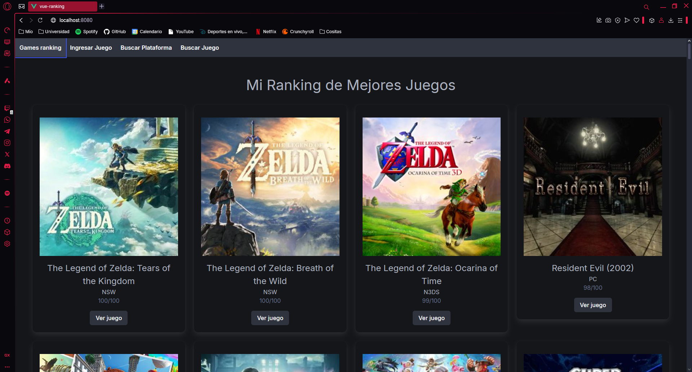
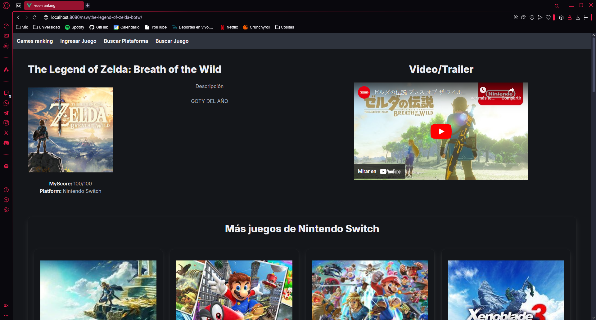
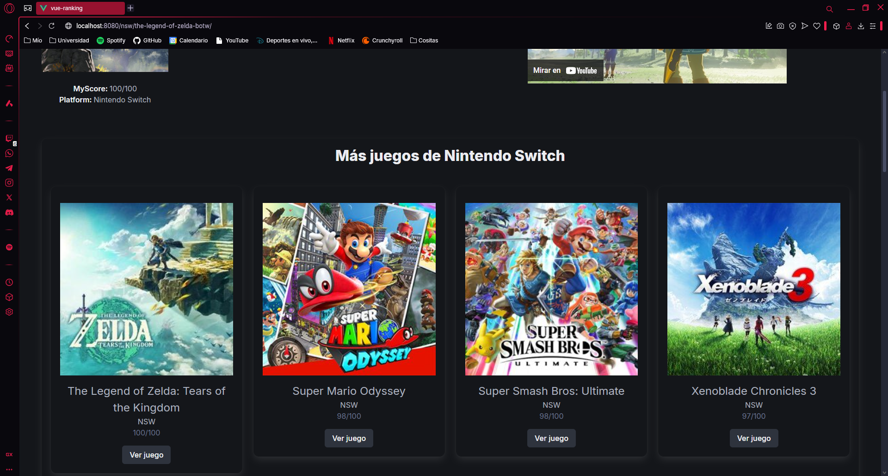
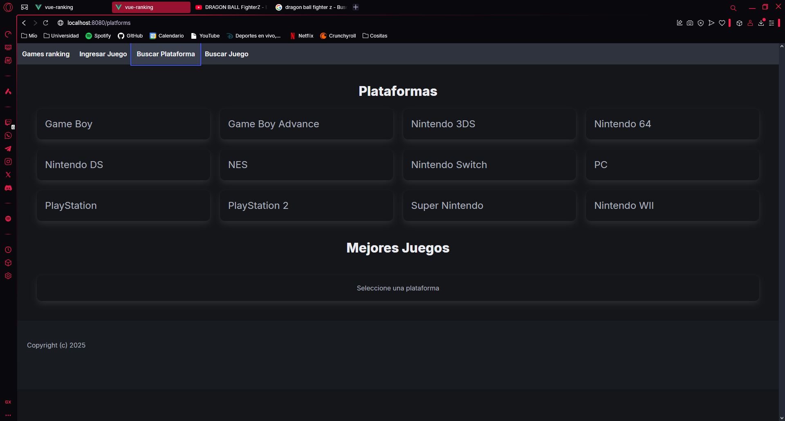
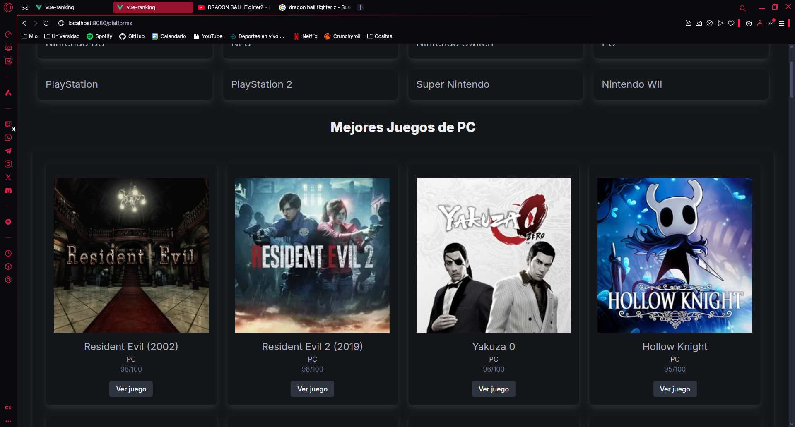
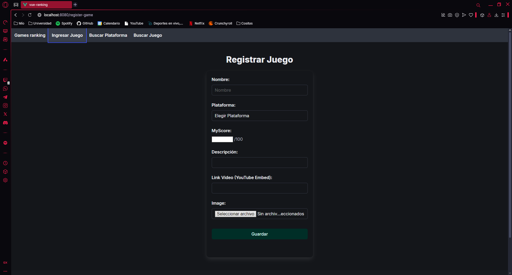
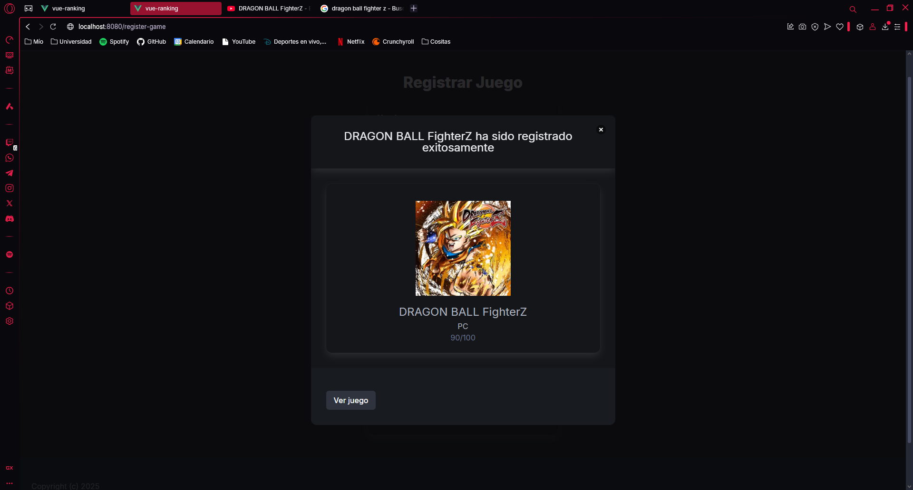
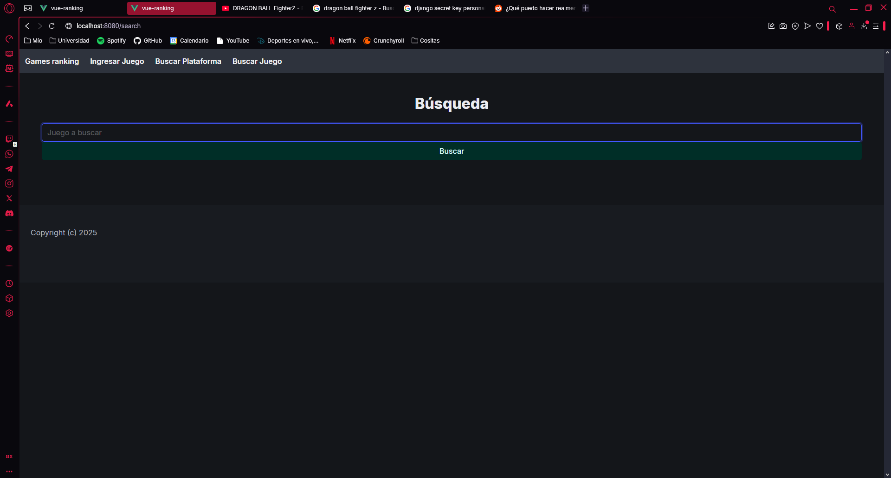
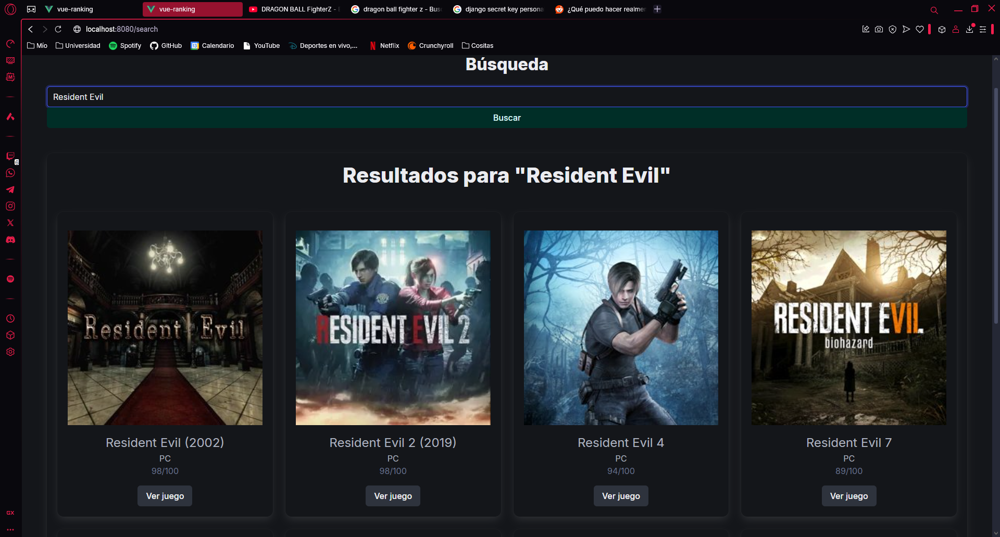

# Games Ranking

## Motivación

Uno de mis pasatiempos favoritos (por no decir el más) son los videojuegos, y resulta que quería anotar los juegos que terminaba, por ende los anotaba en las notas de mi teléfono, pero luego quise anotar también mi valoración de los mismos juegos, por ende los anotaba en las mismas notas. 

Pasó el tiempo y me di cuenta que era un proceso muy engorroso e incómodo, es por ello que decidí realizar una aplicación web en donde pueda visualizar las valoraciones de cada juego que me terminaba (y también los juegos por sí solos), así surge la idea y motivación de este pequeño proyecto personal.

## Herramientas utilizadas

- Django
- Vue.js

    Utilicé Django porque a la hora de empezar el proyecto tenía manejo básico del mismo, además de querer profundizar mis conocimientos del mismo y aplicarlos de buena forma.

    Y por último utilicé Vue.js porque me sentí motivado para aprender a utilizar un framework de front-end, e indagando me decanté por Vue, ya que se veía sencillo de utilizar y permite tener todos los elementos necesarios para una vista en un solo archivo, como el estilo (CSS), estructura (HTML), y código (Javascript).

## Vistas

- **Home**

     
    

 

- **Game**

    
Información del juego

     
    
     
    

 

- **Platforms**

     
    
     
    

 

- **Register**
     
    
     
    

 

- **Search**
     
    
     
    